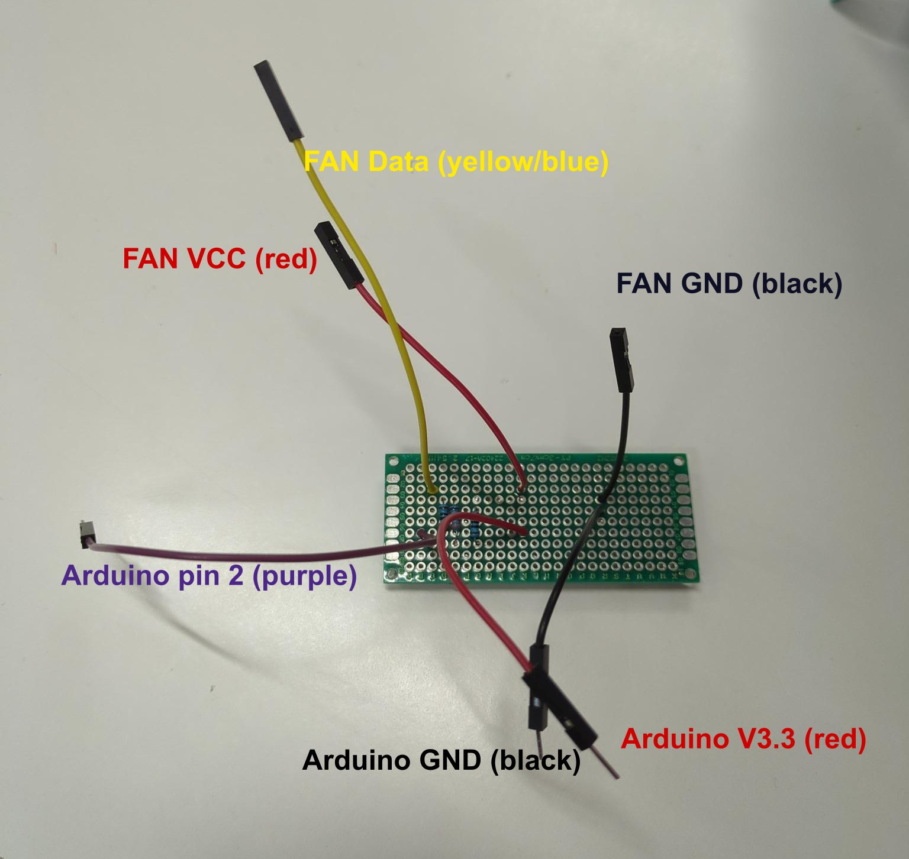

# Building the controller

## Hardware

You need:

- a fan with 3 pins
- an Arduino Leonardo (Uno or similar should work, too)
- a ~300 Ohm resistor (can also be more, doesn't need to be accurate)
- cables

The fan pins should be GND, VCC and data (RPM).
If you have a fan with 4 pins, you need to figure out with one is the data pin.
If you have a fan with 2 pins, this method will not work for you.

The Arduino's 3.3V connects to the fan's VCC.
Behind this connection insert the resistor, behind this resistor connect digital pin 2 and the fan's data.
The fan's GND goes to GND;

I soldered the ends onto a board like so, but can also just use jumper wires

## Software

Open this sketch in the Arduino IDE and flash it onto your board!

Depending on your operating system you have to change the name of the serial port in the Godot code.
